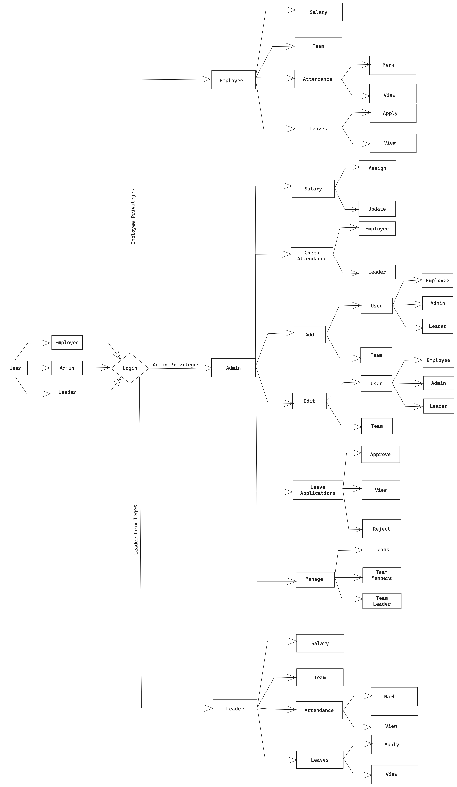
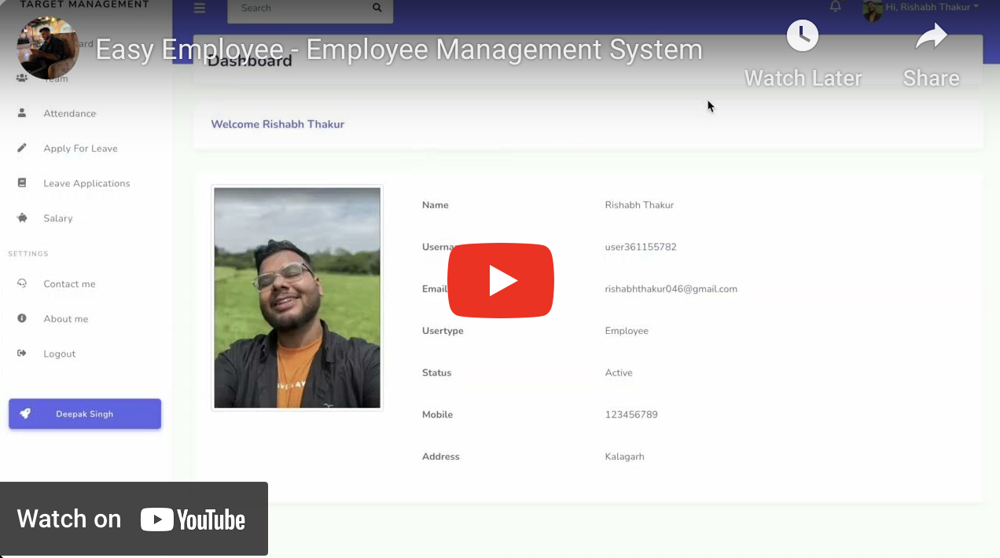

### Employee Management System

The Employee Management System (EMS) project is a comprehensive solution designed to streamline and enhance the efficiency of managing employee-related tasks within an organization. Built on the MERN (MongoDB, Express.js, React, Node.js) stack, this system integrates cutting-edge technologies to provide a robust, scalable, and user-friendly platform for effective employee administration.
The main motive of to build this application to manage the employee, teams, leaders, and targets of a company.


## Roles
- Admin
- Leader
- Employee

## Current Backend Features
### Auth
- Login
- Forgot Password
- Reset Password
- Logout
- Refresh Access Token

### Admin
- Create User
- Update User
- Employees
- Free Employees
- Check Attendance
- Check Attendance of Specific Employee
- Check Attendance of particular time period
- View Leave Applications
- Approve and Disapprove Leave Applications
- Assign Salary to Employees
- View Salary
- Update Salary
- Employee
- User - No Filter (Admin,Leader,Employee)
- Admins
- Admin
- Leaders
- Leader
- Create Team
- Update Team
- Teams
- Team
- Team Members
- Add Team Member
- Remove Team Member
- Add Team Leader
- Remove Team Member
- Counts

### Leader
- Update Self Account
- Mark Attendance
- View Self Attendance
- View Self Attendance of Specific time period
- Apply for Leave 
- Check status for Leave
- View Salary
### Employee
- Update Self Account
- Mark Attendance
- View Self Attendance
- View Self Attendance of Specific time period
- Apply for Leave 
- Check status for Leave
- View Salary


## Flow Chart


## Video
[](https://youtu.be/jcdBcxDJ2x8)


## Screenshots

### Login


### Admin


### Employee


## Installation

Client Repository: https://github.com/deepak-singh5219/Easy-Employee

Server Repository: https://github.com/deepak-singh5219/Easy-Employee-API

Follow these steps to set up the Employee Management System on your local machine:

### Prerequisites

Make sure you have the following installed:

- [Node.js](https://nodejs.org/)
- [MongoDB](https://www.mongodb.com/try/download/community)

### Clone the Repository

#### client

```bash
git clone https://github.com/deepak-singh5219/Easy-Employee
cd Easy-Employee
npm install
```
Make sure your environment variables are configured properly.
```
REACT_APP_BASE_URL=http://localhost:5500
```

#### server

```bash
git clone https://github.com/deepak-singh5219/Easy-Employee-API
cd Easy-Employee-API
npm install
```

Make sure your environment variables are configured properly.
```
ACCESS_TOKEN_SECRET_KEY=SECRET_KEY
REFRESH_TOKEN_SECRET_KEY=REFRESH_KEY

BASE_URL=SERVER_BASE_URL
DB_URL=DATABASE_URL
CLIENT_URL=CLIENT_BASE_URL
TYPE_FORGOT_PASSWORD=2
WEBSITE_NAME=Easy Employee
BCRYPT_PASSWORD_SALT_FACTOR=10

SMTP_HOST=smtp.gmail.com
SMTP_PORT=465
SMTP_SECURE=false
SMTP_REQUIRE_TLS=true
SMTP_AUTH_USER=EMAIL
SMTP_AUTH_PASS=PASSWORD
```

At cleint application
```
npm run start
```

At server application
```
npm run dev
```

## 🚀 About Me
I'm a full stack developer...
