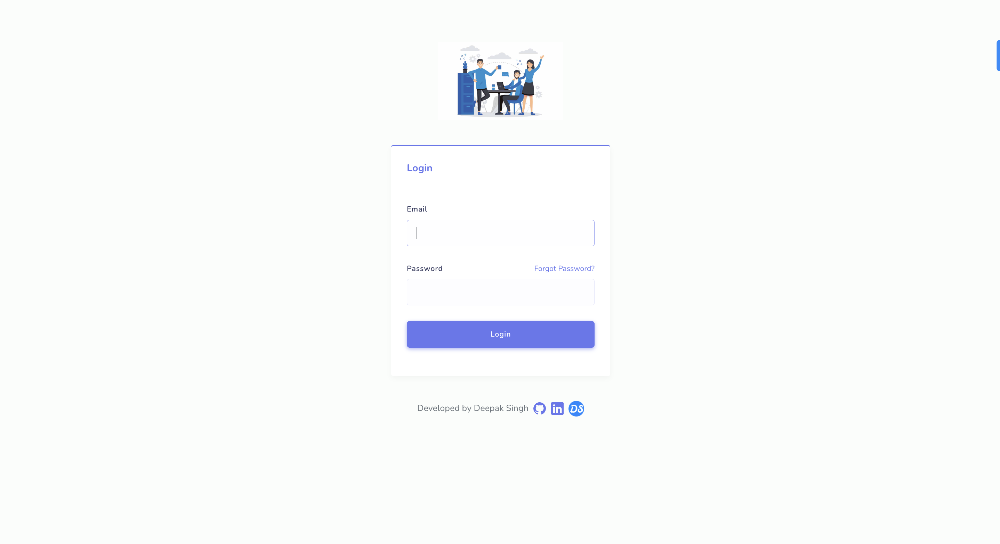
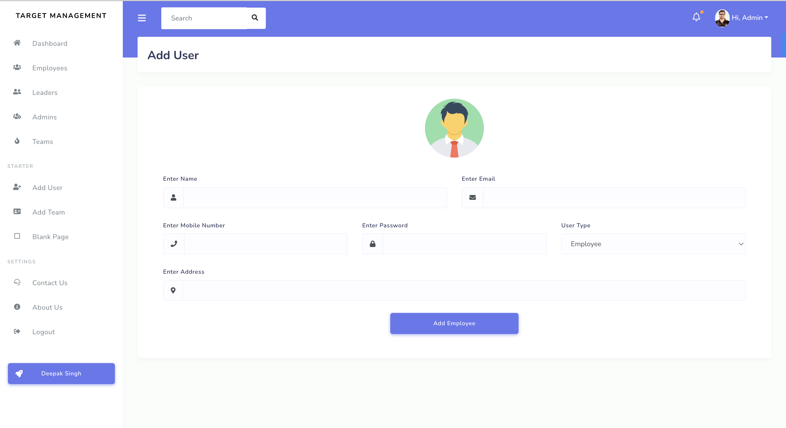
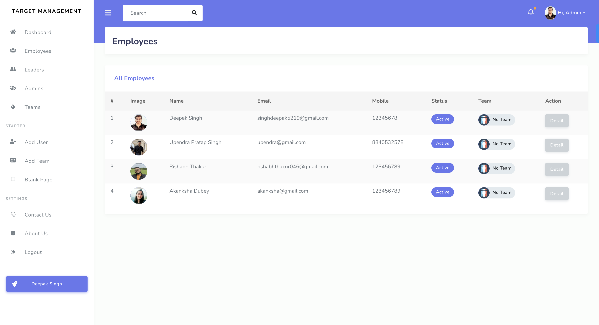
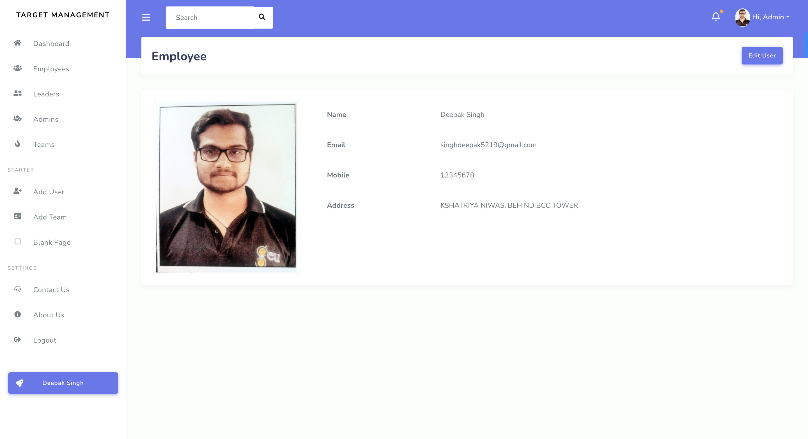
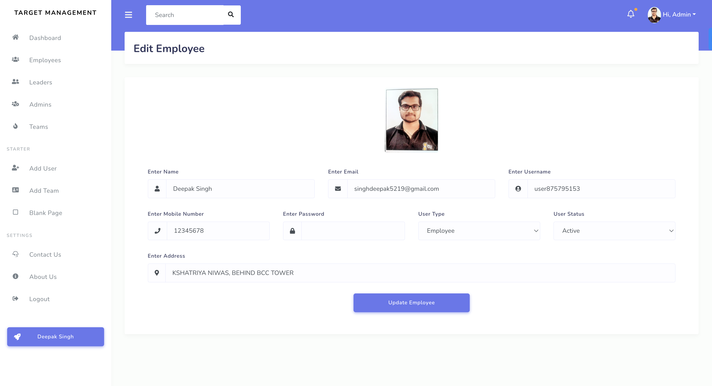
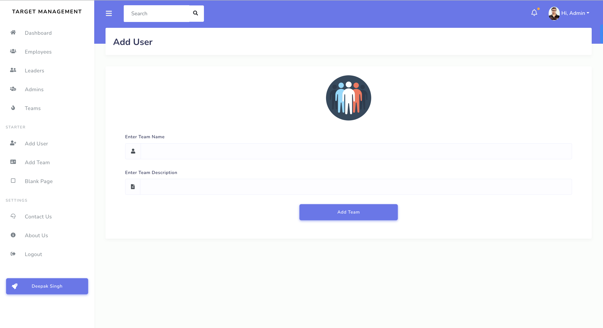
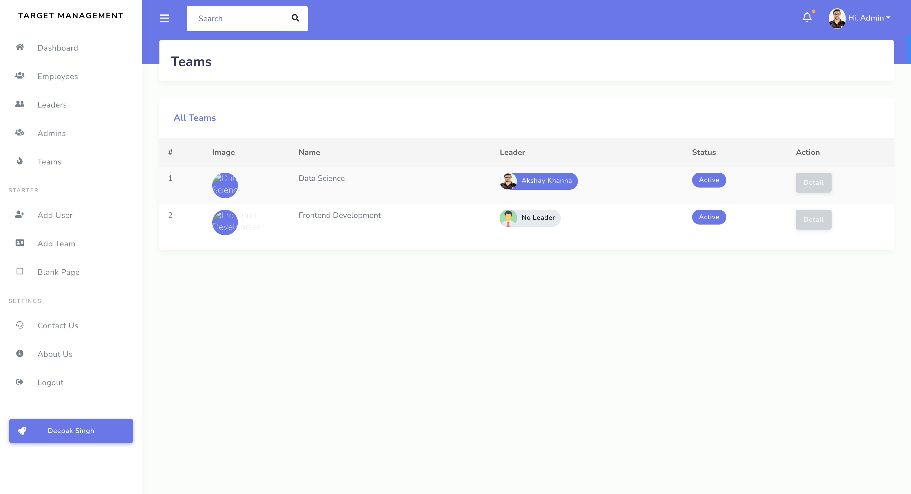
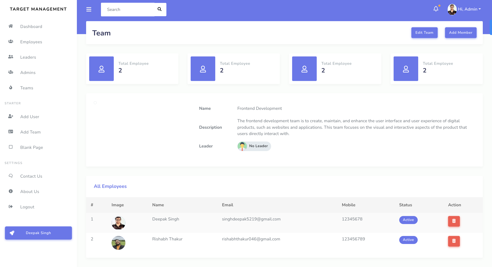

### Employee Management System

The main motive of to build this application to manage the employee, teams, leaders, and targets of your company.

Using this script you can track your employee targets etc.. export the details in cvs and pdf. and much more.

## Features

- Light/dark mode toggle
- Live previews
- Fullscreen mode
- Cross platform

## Roles
- Admin
- Leader
- Employee

## Current Backend Features
### Auth
- Login
- Forgot Password
- Reset Password
- Logout
- Refresh Access Token

### Admin
- Create User
- Update User
- Employees
- Free Employees
- Check Attendance
- Check Attendance of Specific Employee
- Check Attendance of particular time period
- View Leave Applications
- Approve and Disapprove Leave Applications
- Employee
- User - No Filter (Admin,Leader,Employee)
- Admins
- Admin
- Leaders
- Leader
- Create Team
- Update Team
- Teams
- Team
- Team Members
- Add Team Member
- Remove Team Member
- Add Team Leader
- Remove Team Member
- Counts

### Leader
- Update Self Account
### Employee
- Update Self Account
- Mark Attendance
- View Self Attendance
- View Self Attendance of Specific time period
- Apply for Leave 
- Check status for Leave

## Flow Chart

## Screenshots

## 🚀 About Me
I'm a full stack developer...
